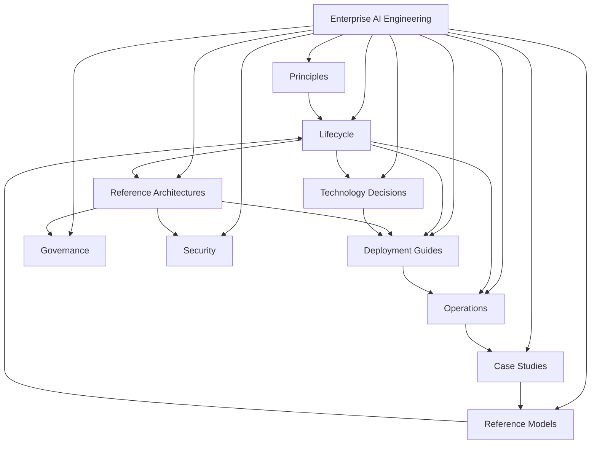

# Enterprise AI Knowledge Graph

> Canonical map of the Enterprise AI Playbook.

---

## Overview

The Enterprise AI Playbook is organized as an engineering knowledge graph.

Rather than treating documentation as isolated topics, each document contributes to a connected body of engineering knowledge.

---

---

# Reading Order

Recommended sequence for first-time readers:

1. Enterprise AI Principles
2. Enterprise AI Lifecycle
3. Enterprise AI Reference Architecture
4. Enterprise AI Maturity Model
5. Technology Decisions
6. Deployment Guides
7. Operations
8. Case Studies

---

# Engineering Philosophy

Knowledge is cumulative.

Each document should:

- extend previous knowledge;
- avoid duplication;
- reference related concepts;
- remain technology-agnostic whenever possible.